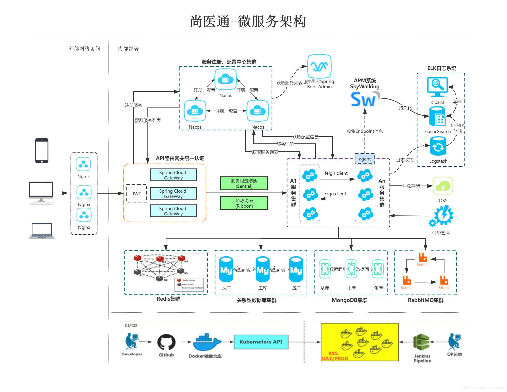
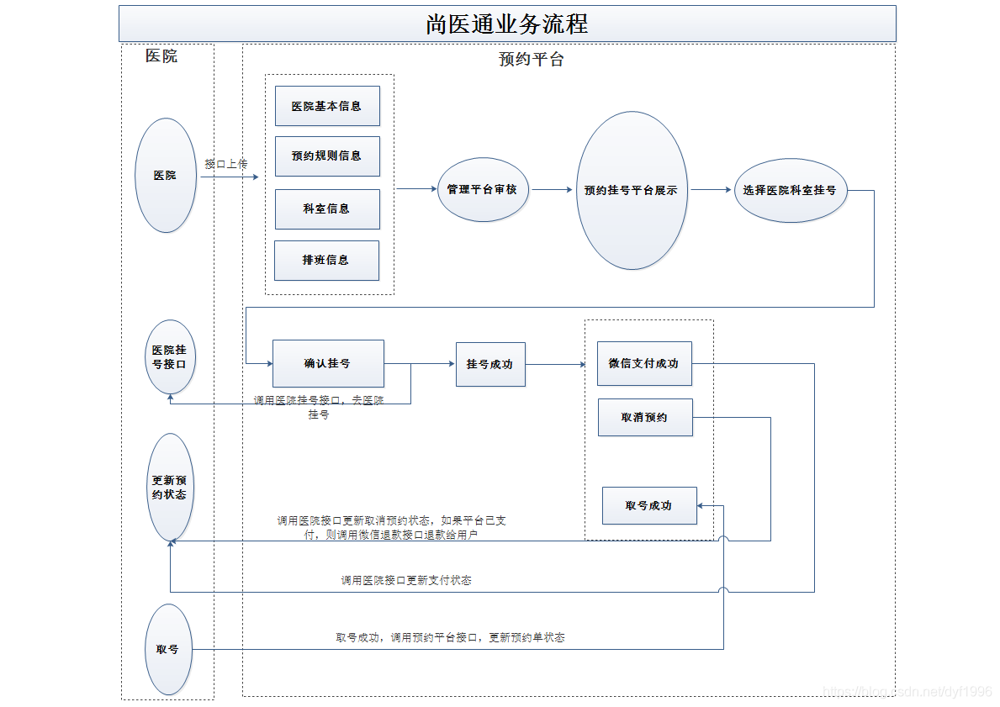
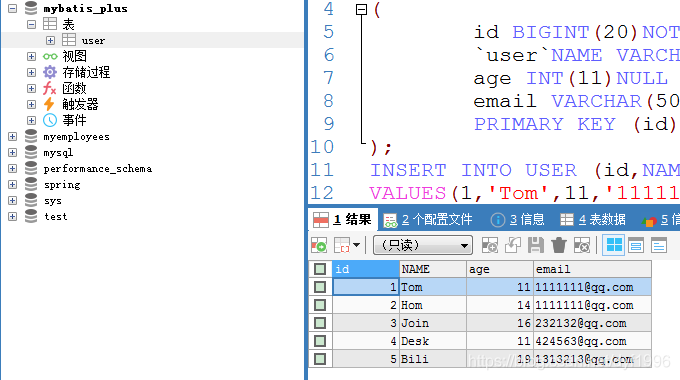
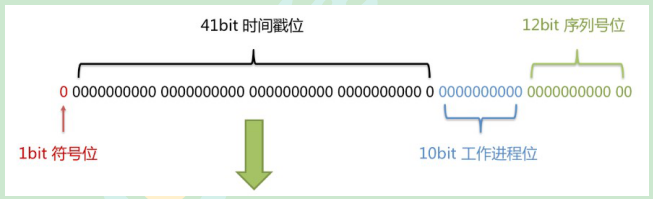

# 一、尚医通架构图与业务流程图





# 二、项目需求技术

> **SpringBoot：简化新spring应用的初始化搭建以及开发过程**
>
> **SpringCloud：基于SpringBoot实现的云原声应用开发工具，使用的技术有SpringCloud Gateway（网关）、      			SpringCloud Alibaba Nacos（服务注册）、SpringCLoud Alibaba Sentinel、SpringCloud Task和SpringCloud Feign等**
>
> **MyBatis-Plus：持久层框架**
>
> **Redis：内存缓存**
>
> **RabbitMQ：消息中间件**

# 三、熟悉MyBatis-Plus

## **1.创建一个表，插入一些数据**

```java
CREATE DATABASE mybatis_plus;
USE mybatis_plus;
CREATE TABLE USER
(
	id BIGINT(20)NOT NULL COMMENT '主键 ID',
	`user`NAME VARCHAR(30)NULL DEFAULT NULL COMMENT '姓名',
	age INT(11)NULL DEFAULT NULL COMMENT '年龄',
	email VARCHAR(50)NULL DEFAULT NULL COMMENT '邮箱',
	PRIMARY KEY (id)
);
INSERT INTO USER (id,NAME,age,email)
VALUES(1,'Tom',11,'1111111@qq.com'),
(2,'Hom',14,'1111111@qq.com'),
(3,'Join',16,'232132@qq.com'),
(4,'Desk',11,'424563@qq.com'),
(5,'Bili',19,'1313213@qq.com');
SELECT * FROM USER;

```



## **2.创建一个springboot工程**

### **①配置idea相关设置**

> **java Complier** 设置JDK版本为1.8
> 		**file Encodings** 设置项目和文件编码为UTF-8
> 		**Build Tools》Maven** 确认Maven本地仓库路径

### **②使用 Spring Initializr 快速初始化一个 Spring Boot 工程**

### **③引入相关依赖**

```java
<?xml version="1.0" encoding="UTF-8"?>
<project xmlns="http://maven.apache.org/POM/4.0.0" xmlns:xsi="http://www.w3.org/2001/XMLSchema-instance"
         xsi:schemaLocation="http://maven.apache.org/POM/4.0.0 https://maven.apache.org/xsd/maven-4.0.0.xsd">
    <modelVersion>4.0.0</modelVersion>
    <groupId>com.mzxssg</groupId>
    <artifactId>demomptest</artifactId>
    <version>0.0.1-SNAPSHOT</version>
    <name>demomptest</name>
    <description>Demo project for Spring Boot</description>

    <properties>
        <java.version>1.8</java.version>
        <project.build.sourceEncoding>UTF-8</project.build.sourceEncoding>
        <project.reporting.outputEncoding>UTF-8</project.reporting.outputEncoding>
        <spring-boot.version>2.2.1.RELEASE</spring-boot.version>
    </properties>

    <dependencies>
        <dependency>
            <groupId>org.springframework.boot</groupId>
            <artifactId>spring-boot-starter</artifactId>
        </dependency>

        <dependency>
            <groupId>org.springframework.boot</groupId>
            <artifactId>spring-boot-starter-test</artifactId>
            <scope>test</scope>
            <exclusions>
                <exclusion>
                    <groupId>org.junit.vintage</groupId>
                    <artifactId>junit-vintage-engine</artifactId>
                </exclusion>
            </exclusions>
        </dependency>

        <!--mybatis-plus依赖-->
        <dependency>
            <groupId>com.baomidou</groupId>
            <artifactId>mybatis-plus-boot-starter</artifactId>
            <version>3.3.1</version>
        </dependency>

        <!--mysql依赖-->
        <dependency>
            <groupId>mysql</groupId>
            <artifactId>mysql-connector-java</artifactId>
        </dependency>

        <!--简化实体类开发-->
        <dependency>
            <groupId>org.projectlombok</groupId>
            <artifactId>lombok</artifactId>
        </dependency>

    </dependencies>

    <dependencyManagement>
        <dependencies>
            <dependency>
                <groupId>org.springframework.boot</groupId>
                <artifactId>spring-boot-dependencies</artifactId>
                <version>${spring-boot.version}</version>
                <type>pom</type>
                <scope>import</scope>
            </dependency>
        </dependencies>
    </dependencyManagement>

    <build>
        <plugins>
            <plugin>
                <groupId>org.apache.maven.plugins</groupId>
                <artifactId>maven-compiler-plugin</artifactId>
                <version>3.8.1</version>
                <configuration>
                    <source>1.8</source>
                    <target>1.8</target>
                    <encoding>UTF-8</encoding>
                </configuration>
            </plugin>
            <plugin>
                <groupId>org.springframework.boot</groupId>
                <artifactId>spring-boot-maven-plugin</artifactId>
                <version>2.3.7.RELEASE</version>
                <configuration>
                    <mainClass>com.mzxssg.demomptest.DemomptestApplication</mainClass>
                </configuration>
                <executions>
                    <execution>
                        <id>repackage</id>
                        <goals>
                            <goal>repackage</goal>
                        </goals>
                    </execution>
                </executions>
            </plugin>
        </plugins>
    </build>

</project>

```

> **这里用到一个lombok插件，能帮我们bean类自动创建get，set方法，只需要在类上注解@data即可**

### **④在 application.properties 配置文件中添加 MySQL 数据库的相关配置**

```java
spring.datasource.driver-class-name=com.mysql.cj.jdbc.Driver
spring.datasource.url=jdbc:mysql://localhost:3306/mybatis_plus?serverTimezone=GMT%2B8
spring.datasource.username=root
spring.datasource.password=

#mybatis日志
mybatis-plus.configuration.log-impl=org.apache.ibatis.logging.stdout.StdOutImpl
```

***注意：***

> **1、这里的 url 使用了 ?serverTimezone=GMT%2B8后缀，因为8.0版本的jdbc驱动需要添加这个后缀，否则运行测试用例报告如下错误：**
> **java.sql.SQLException: The server time zone value ‘Öйú±ê׼ʱ¼ä’ is unrecognized or representsmore**
>
> **2、这里的 driver-class-name 使用了 com.mysql.cj.jdbc.Driver ，在 jdbc 8中 建议使用这个驱动，否则运行测试用例的时候会有 WARN 信息**

### **⑤启动类注解**

> **1.在 Spring Boot 启动类中添加 @MapperScan 注解，扫描 Mapper 文件夹**
> 		**2.启动类本身注解@SpringBootApplication**

### **⑥编写实体类，对应数据库**

```java
@Data
public class User{
	private long id;
	private String name;
	private Integer age;
	private String email;
	//使用了lombok插件的注解，无需再手动写入get、set方法	
}

```

### **⑦编写Mapper接口**

> **这里直接继承mp的BaseMapper接口，泛型选择自己的实体类**

```java
@Repository
public interface UserMapper extends BaseMapper<User> {
//BaseMapper接口提供了大量的crud方法，无需自己再一一实现
}

```

### **⑧添加测试类，进行功能测试**

```java
@SpringBootTest
class DemomptestApplicationTests {
//利用SpringBootTest自带快捷测试
    @Autowired
    private UserMapper userMapper;
    
    //查找
    @Test
    public void findAll() {
        List<User> users = userMapper.selectList(null);
        System.out.println(users);
    }
```

**注意：**

> **IDEA在 userMapper 处报错，因为找不到注入的对象，其实该类是动态创建的，程序是可以正确执行的。 但是为了避免报错，可以在 dao 层 的接口上添加 @Repository 注**

**至此，mp的基本熟悉测试已经完成。**

## 四、雪花算法

> **MyBatis-Plus默认的主键策略是：ASSIGN_ID （使用了雪花算法）**
> 		**雪花算法：分布式ID生成器**
> 		**雪花算法是由Twitter公布的分布式主键生成算法，它能够保证不同表的主键的不重复性，以及相同表的主键的有序性。**

**核心思想：**
		☆ 长度共64bit（一个long型）。

☆ 首先是一个符号位，1bit标识，由于long基本类型在Java中是带符号的，最高位是符号位，正数是0，负数是1，所以id一般是正数，最高位是0。

☆ 41bit时间截(毫秒级)，存储的是时间截的差值（当前时间截 - 开始时间截)，结果约等于69.73年。

☆ 10bit作为机器的ID（5个bit是数据中心，5个bit的机器ID，可以部署在1024个节点）。

☆ 12bit作为毫秒内的流水号（意味着每个节点在每毫秒可以产生 4096 个 ID）。

**总结**：利用机器的编号加上正向有序时间的时间截的差值**实现主键的不重复性和保证相同表的主键的有序性**



**AUTO 自增策略**：

> **需要在创建数据表的时候设置主键自增**
> 		**实体字段中配置 @TableId(type = IdType.AUTO)**

```java
@TableId(type = IdType.AUTO)
private Long id;
```

**注意**：要想影响所有实体的配置，可以设置全局主键配置

```java
#全局设置主键生成策略
mybatis-plus.global-config.db-config.id-type=auto
```

## 五、自动填充

> **项目中经常会遇到一些数据，每次都使用相同的方式填充，例如记录的创建时间，更新时间等。我们可以使用MyBatis Plus的自动填充功能，完成这些字段的赋值工作**

**更新操作**

```java
//修改操作，update时生成的sql自动是动态sql：UPDATE user SET age=? WHERE id=? 
@Test
public void testUpdate() {
    User user = new User();
    user.setId(1340868235401764865L);
    user.setName("lucymary");
    int count = userMapper.updateById(user);
    System.out.println(count);
}

```

**实现自动填充**

①在User表中添加datetime类型的新的字段 create_time、update_time

```java
--添加表字段
    alter  table  User(表名)  
    add  create_time(列名)  datetime(字段的属性和长度)  not  NULL(设置非空)  DEFAULT  0(默认值设置为0)
    alter  table  User(表名)  
    add update_time(列名)  datetime(字段的属性和长度)  not  NULL(设置非空)  DEFAULT  0(默认值设置为0)

```

②实体上增加字段并添加自动填充注解

```java
@TableField(fill = FieldFill.INSERT)
private Date createTime;  //create_time

@TableField(fill = FieldFill.INSERT_UPDATE)
private Date updateTime; //update_time

```

③实现元对象处理器接口

> **编写一个handler去处理前面的注解，根据列名去进行自动填充**

```java
@Component
public class MyMetaObjectHandler implements MetaObjectHandler {

    //mp执行添加操作，这个方法执行
    @Override
    public void insertFill(MetaObject metaObject) {
        this.setFieldValByName("createTime",new Date(),metaObject);
        this.setFieldValByName("updateTime",new Date(),metaObject);
    }

    //mp执行修改操作，这个方法执行
    @Override
    public void updateFill(MetaObject metaObject) {
        this.setFieldValByName("updateTime",new Date(),metaObject);
    }
}

```

## 六、乐观锁

> **当要更新一条记录的时候，希望这条记录没有被别人更新，也就是说实现线程安全的数据更新**

**乐观锁实现方式：**

> **取出记录时，获取当前version**
> 		**更新时，带上这个version 执行更新时， set version = newVersion where version = oldVersion 如果version不对，就更新失败**

**①在实体类添加@Version注解，并且让其添加时自动填充值**

```java
	@Version
    @TableField(fill = FieldFill.INSERT)
    private Integer version;

```

在元对象处理器类MyMetaObjectHandler中insertFill方法里加上

```java
this.setFieldValByName("version", 1, metaObject);
```

加上后的即为：

```java
@Component
public class MyMetaObjectHandler implements MetaObjectHandler {
    @Override
    public void insertFill(MetaObject metaObject) {
        this.setFieldValByName("createTime", new Date(), metaObject);
        this.setFieldValByName("updateTime", new Date(), metaObject);
        this.setFieldValByName("version", 1, metaObject);
    }
}
```

**②创建配置文件**

> **创建包config，创建文件MybatisPlusConfig.java**
> 		**此时可以删除主类中的 @MapperScan 扫描注解**
> 		**让配置类去扫描即可**

```java
@Configuration
@MapperScan("mapper类的路径")
public class MpConfig {
}

```

**③注册乐观锁的bean**

```java
/**
* 乐观锁插件，在config类中去注册即可
*/
@Bean
public OptimisticLockerInterceptor optimisticLockerInterceptor() {
return new OptimisticLockerInterceptor();
}

```

## 七、分页插件

> **mp自带了分页插件，只需要进行配置即可**

**①在配置类中添加分页插件**

```java
/**
 * 分页插件，也是在配置类中注册
 */
@Bean
public PaginationInterceptor paginationInterceptor() {
    return new PaginationInterceptor();
}

```

注意：mp版本在3.4以上的PaginationInterceptor已经弃用，如果时3.4以上版本的改为如下代码：

```java
	@Bean
    public MybatisPlusInterceptor mybatisPlusInterceptor(){
        MybatisPlusInterceptor interceptor = new MybatisPlusInterceptor(); 
        interceptor.addInnerInterceptor(new OptimisticLockerInnerInterceptor());
        return interceptor; 
    }
```

**②测试selectPage分页**

```java
    //分页查询
    @Test
    public void testSelectPage(){
        Page<User> page = new Page<>(1,3);
        Page<User> userPage = userMapper.selectPage(page, null);
        long pages = userPage.getPages();//总页数
        long current = userPage.getCurrent();//当前页
        List<User> records = userPage.getRecords();//查询数据集合
        long total = userPage.getTotal();//表中总记录数
        boolean hasNext = userPage.hasNext();//是否有下一页
        boolean hasPrevious = userPage.hasPrevious();//是否有上一页
        System.out.println("总页数： "+pages+
                "\n当前页:  "+current+
                "\n查询数据集合  "+records+
                "\n表中总记录数  "+total+
                "\n是否有上一页  "+hasPrevious+
                "\n是否有下一页  "+hasNext);
    }
```

**③测试selectMapsPage分页**

> **当指定了特定的查询列时，希望分页结果列表只返回被查询的列，而不是很多null值**

```java
@Test
public void testSelectMapsPage() {
//Page不需要泛型
Page<Map<String, Object>> page = new Page<>(1, 5);
Page<Map<String, Object>> pageParam = userMapper.selectMapsPage(page, null);
List<Map<String, Object>> records = pageParam.getRecords();
records.forEach(System.out::println);
System.out.println(pageParam.getCurrent());
System.out.println(pageParam.getPages());
System.out.println(pageParam.getSize());
System.out.println(pageParam.getTotal());
System.out.println(pageParam.hasNext());
System.out.println(pageParam.hasPrevious());
}
```

## 八、删除

**①普通删除（物理删除）**

```java
1.deleteById(5L);
2.deleteBatchIds(Arrays.asList(8, 9, 10));
3.map.put("name", "Helen");
  map.put("age", 18);
  deleteByMap(map);

```

**②逻辑删除**

> **逻辑删除不会实际删除数据库的内容，只是实现逻辑上的删除**

**1.数据库修改，添加 deleted字段**

```java
ALTER TABLE `user` ADD COLUMN `deleted` boolean DEFAULT false
```

**2.实体类修改，添加deleted字段并且添加@TableLogic注解**

```java
	@TableLogic
    @TableField(fill = FieldFill.INSERT)
    private Integer deleted;//0:代表还没删除  1：代表已经被删除
```

在元对象处理器类MyMetaObjectHandler中insertFill方法里加上

```java
this.setFieldValByName("deleted", 0, metaObject);
```

加上后即为：

```java
@Component
public class MyMetaObjectHandler implements MetaObjectHandler {
    @Override
    public void insertFill(MetaObject metaObject) {
        this.setFieldValByName("createTime", new Date(), metaObject);
        this.setFieldValByName("updateTime", new Date(), metaObject);
        this.setFieldValByName("version", 1, metaObject);
        this.setFieldValByName("deleted", 0, metaObject);
    }
}
```

**3.在配置中加入配置，以下是默认值，可以不配直接使用默认值**

```java
mybatis-plus.global-config.db-config.logic-delete-value=1
mybatis-plus.global-config.db-config.logic-not-delete-value=0
```

**4.测试**

```java
@Test
public void testLogicDelete() {
    int result = userMapper.deleteById(1L);
	system.out.println(result);
}

```

> **测试后发现，数据并没有被删除，deleted字段的值由0变成了1 测试后分析打印的sql语句，是一条update**
> **注意：被删除前，数据的deleted 字段的值必须是 0，才能被选取出来执行逻辑删除的操作**

**5.补充：测试逻辑删除后的查询**

> **MyBatis Plus中查询操作也会自动添加逻辑删除字段的判断**
> 		**根据逻辑删除字段的状态判断该数据在逻辑上是存在还是不存在的**

